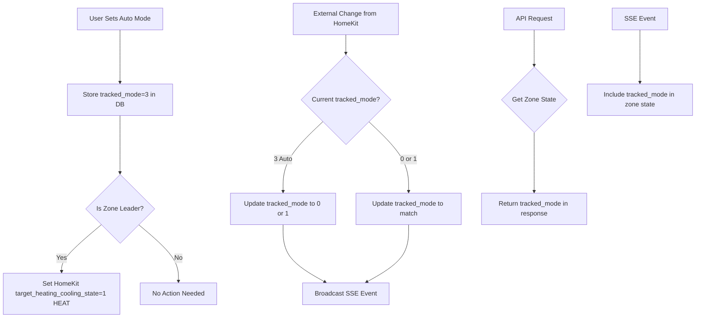

# Auto Mode Tracking for Zones

## Overview

HomeKit thermostats only support 2 HVAC modes (0=OFF, 1=HEAT). This plan adds an internal "Auto" mode (3) that is tracked per zone. When a zone is in Auto mode, the thermostat's HVAC mode appears as HEAT to HomeKit, but internally the zone tracks mode 3. When external changes occur (user changes thermostat via HomeKit), the tracked_mode updates to match the external change (0 or 1).

## Architecture



## Database Changes

**Migration to version 3**: Add `tracked_mode` column to `zones` table

- Column: `tracked_mode INTEGER DEFAULT 1` (0=OFF, 1=HEAT, 3=Auto)
- Default to 1 (HEAT) for existing zones
- Update `ensure_schema_and_migrate()` in [`tado_local/database.py`](tado_local/database.py)

## Core Implementation

### 1. Database Migration (`tado_local/database.py`)

- Add migration to version 3 that:
  - Adds `tracked_mode INTEGER DEFAULT 1` column to `zones` table
  - Initializes existing zones with `tracked_mode = 1` (HEAT)
  - Updates `SUPPORTED_SCHEMA_VERSION` to 3

### 2. State Manager Updates (`tado_local/state.py`)

Add methods to `DeviceStateManager`:

- `get_zone_tracked_mode(zone_id: int) -> int`: Get tracked_mode for a zone
- `set_zone_tracked_mode(zone_id: int, mode: int) -> None`: Set tracked_mode for a zone
- Load tracked_mode into zone cache on initialization

### 3. External Change Detection (`tado_local/api.py`)

In `handle_change()` method:

- When `TargetHeatingCoolingState` changes from external source (HomeKit):
  - Get zone_id for the device
  - Get current `tracked_mode` for the zone
  - If `tracked_mode == 3` (Auto), update it to match the new value (0 or 1)
  - If `tracked_mode` is 0 or 1, update it to match the new value
  - Save to database

### 4. Auto Mode Enforcement (`tado_local/api.py`)

When setting zone mode via API:

- If setting `tracked_mode = 3` (Auto):
  - Store `tracked_mode = 3` in database
  - Set HomeKit `target_heating_cooling_state = 1` (HEAT) on zone leader
- If setting `tracked_mode = 0` or `1`:
  - Store `tracked_mode` in database
  - Set HomeKit `target_heating_cooling_state` to match (0 or 1)

### 5. API Endpoints (`tado_local/routes.py`)

**Update existing endpoints:**

- `GET /zones/{zone_id}`: Include `tracked_mode` in zone state response
- `GET /zones`: Include `tracked_mode` in each zone's state
- `POST /zones/{zone_id}/set`: Add optional `mode` parameter
  - Accepts: `"off"` (0), `"heat"` (1), or `"auto"` (3)
  - When `mode="auto"`, set `tracked_mode=3` and HomeKit `target_heating_cooling_state=1`
  - When `mode="off"` or `"heat"`, set `tracked_mode` and HomeKit state to match

**New endpoint (optional):**

- `POST /zones/{zone_id}/mode`: Set tracked_mode only (alternative to extending `/set`)

### 6. SSE Events (`tado_local/api.py`)

Update `broadcast_state_change()` and `_build_device_state()`:

- Include `tracked_mode` in zone state events
- Zone events should show `tracked_mode` instead of (or in addition to) `mode`
- Device events continue to show `mode` from HomeKit state

### 7. Zone State Building (`tado_local/routes.py`)

In zone state building logic:

- Read `tracked_mode` from database/zone cache
- Include `tracked_mode` in state summary
- Keep `mode` field for backward compatibility (shows HomeKit state)
- Add `tracked_mode` as new field in API responses

## Implementation Details

### Database Schema Update

```sql
-- Migration to version 3
ALTER TABLE zones ADD COLUMN tracked_mode INTEGER DEFAULT 1;
UPDATE zones SET tracked_mode = 1 WHERE tracked_mode IS NULL;
```

### Mode Mapping

- `tracked_mode = 0`: OFF → HomeKit sees `target_heating_cooling_state = 0`
- `tracked_mode = 1`: HEAT → HomeKit sees `target_heating_cooling_state = 1`
- `tracked_mode = 3`: Auto → HomeKit sees `target_heating_cooling_state = 1` (but internally tracked as 3)

### External Change Flow

1. HomeKit device changes `target_heating_cooling_state` (via app, physical control, etc.)
2. `handle_change()` receives update with source="EVENT" or "POLLING"
3. Check if device is zone leader
4. Get current `tracked_mode` for zone
5. Update `tracked_mode` to match new HomeKit value (0 or 1)
6. Save to database
7. Broadcast SSE event with updated `tracked_mode`

### API Response Format

Zone state will include both fields:

```json
{
  "zone_id": 1,
  "state": {
    "cur_temp_c": 21.5,
    "target_temp_c": 22.0,
    "mode": 1,           // HomeKit state (0=OFF, 1=HEAT)
    "tracked_mode": 3,   // Internal tracked mode (0=OFF, 1=HEAT, 3=Auto)
    "cur_heating": 1
  }
}
```

## Files to Modify

1. **`tado_local/database.py`**: Add migration to version 3
2. **`tado_local/state.py`**: Add tracked_mode getter/setter methods, load into cache
3. **`tado_local/api.py`**: 

   - Update `handle_change()` to sync tracked_mode on external changes
   - Update `broadcast_state_change()` to include tracked_mode
   - Update `_build_device_state()` if needed

4. **`tado_local/routes.py`**: 

   - Update zone endpoints to include tracked_mode
   - Update `POST /zones/{zone_id}/set` to accept mode parameter
   - Update zone state building logic

## Testing Considerations

1. Set zone to Auto mode (3) → verify HomeKit shows HEAT (1)
2. External change to OFF → verify tracked_mode updates to 0
3. External change to HEAT → verify tracked_mode updates to 1
4. API returns tracked_mode in responses
5. SSE events include tracked_mode
6. Migration correctly initializes existing zones

## Backward Compatibility

- Existing API clients will continue to see `mode` field (HomeKit state)
- New `tracked_mode` field is additive, doesn't break existing clients
- Default `tracked_mode = 1` for existing zones maintains current behavior