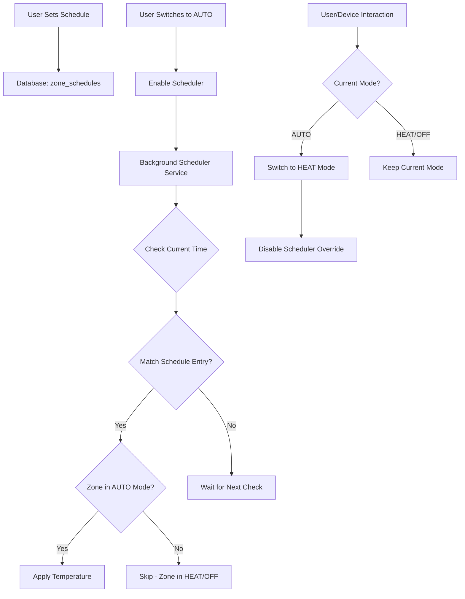

# Climate Scheduler and Auto Mode Implementation

## Overview

This plan extends the TadoLocal GUI and backend to support:

1. **Climate scheduler** for each zone with 3 schedule types (day of week, week/weekends, any day)
2. **AUTO mode** support that tracks mode per zone
3. **Manual override detection** (API calls and physical device changes) that switches from AUTO to HEAT
4. **Background scheduler service** that applies scheduled temperatures when zone is in AUTO mode

## Architecture

### Data Flow



### Database Schema

**Database: SQLite3** (using existing `db_path` from `DeviceStateManager`)

**New table: `zone_schedules`**

- `schedule_id` (INTEGER PRIMARY KEY AUTOINCREMENT)
- `zone_id` (INTEGER, FOREIGN KEY to zones)
- `schedule_type` (TEXT: 'day_of_week', 'week_weekends', 'any_day')
- `days_of_week` (TEXT: JSON array of day numbers 0-6, or 'weekdays'/'weekends')
- `time` (TEXT: HH:MM format, must be in 15-minute intervals: :00, :15, :30, :45)
- `temperature` (REAL: target temperature in °C)
- `enabled` (BOOLEAN: whether schedule is active)
- `created_at` (TIMESTAMP DEFAULT CURRENT_TIMESTAMP)
- `updated_at` (TIMESTAMP DEFAULT CURRENT_TIMESTAMP)
- FOREIGN KEY (zone_id) REFERENCES zones(zone_id) ON DELETE CASCADE

**New table: `zone_mode_tracking`**

- `zone_id` (INTEGER PRIMARY KEY, FOREIGN KEY to zones)
- `current_mode` (INTEGER: 0=Off, 1=Heat, 3=Auto)
- `manual_override_active` (BOOLEAN: true if user manually changed)
- `last_manual_change` (TIMESTAMP: when user last interacted)
- `updated_at` (TIMESTAMP DEFAULT CURRENT_TIMESTAMP)
- FOREIGN KEY (zone_id) REFERENCES zones(zone_id) ON DELETE CASCADE

### Implementation Files

#### 1. Database Schema (`tado_local/database.py`)

- Add migration to create `zone_schedules` and `zone_mode_tracking` tables in SQLite3
- Update `ensure_schema_and_migrate()` to handle schema version 3
- Add validation constraint: `time` must be in 15-minute intervals (:00, :15, :30, :45)
- Use SQLite3 CHECK constraint or application-level validation

#### 2. Scheduler Service (`tado_local/scheduler.py`) - NEW FILE

- `SchedulerService` class that:
  - Runs background task checking schedules every minute
  - Queries active schedules for current time/day
  - Applies temperature only when zone is in AUTO mode
  - Logs scheduler actions
- Integration with `TadoLocalAPI` to call zone control endpoints

#### 3. State Manager Updates (`tado_local/state.py`)

- Add methods to track mode changes:
  - `set_zone_mode(zone_id, mode, is_manual=False)` - track mode and manual override
  - `get_zone_mode(zone_id)` - get current mode and override status
  - `clear_manual_override(zone_id)` - clear override when switching to AUTO

#### 4. API Routes (`tado_local/routes.py`)

- **GET `/zones/{zone_id}/schedules`** - Get all schedules for a zone
- **POST `/zones/{zone_id}/schedules`** - Create new schedule entry
  - Validate `time` parameter is in 15-minute intervals (:00, :15, :30, :45)
  - Return 400 error if time is not in valid interval
- **PUT `/zones/{zone_id}/schedules/{schedule_id}`** - Update schedule entry
  - Validate `time` parameter is in 15-minute intervals
- **DELETE `/zones/{zone_id}/schedules/{schedule_id}`** - Delete schedule entry
- **GET `/zones/{zone_id}/mode`** - Get current mode and override status
- **POST `/zones/{zone_id}/set`** - Update to accept `mode` parameter (extend existing endpoint)
  - When mode is set, track it in `zone_mode_tracking` (SQLite3)
  - When temperature is changed manually, if mode is AUTO, switch to HEAT

#### 5. GUI Updates (`tado_local/static/index.html`)

**Modal Controls Tab:**

- Add "Auto" mode button alongside "Heat" and "Off"
- Update mode button styling to show 3 options
- When Auto is selected, show scheduler status indicator

**New Scheduler Tab:**

- Add "Scheduler" tab to modal (alongside Controls and History)
- Schedule list view showing:
  - Schedule type badge (Day/Week/Any)
  - Days indicator
  - Time and temperature
  - Enable/disable toggle
  - Edit/delete buttons
- Add schedule form:
  - Schedule type selector (radio buttons or dropdown)
  - Day selector (checkboxes for day_of_week, or week/weekends toggle)
  - Time picker (HH:MM) with 15-minute interval constraint
    - Use HTML5 time input with step="900" (15 minutes = 900 seconds)
    - Or custom dropdown with 15-minute options (00:00, 00:15, 00:30, 00:45, 01:00, etc.)
    - Validate on client-side before submission
  - Temperature input (with +/- buttons like main controls)
  - Save/Cancel buttons
- Visual schedule timeline (optional, for better UX)

**Zone Card Updates:**

- Show mode indicator (Auto/Heat/Off) on zone cards
- Visual indicator when scheduler is active

#### 6. API Integration Updates (`tado_local/api.py`)

- Detect manual changes in `handle_change()`:
  - When `target_temperature` or `target_heating_cooling_state` changes from device
  - Check if zone is in AUTO mode
  - If yes, switch to HEAT mode and set manual override flag
- Initialize scheduler service in `initialize()`
- Cleanup scheduler service in `cleanup()`

#### 7. Zone Control Updates (`tado_local/routes.py` - `set_zone` endpoint)

- Accept new `mode` parameter: `'auto'`, `'heat'`, `'off'`
- When mode is set:
  - Update `zone_mode_tracking` table
  - If switching to AUTO, clear manual override flag
  - If switching from AUTO, keep current temperature
- When temperature is changed manually:
  - If current mode is AUTO, automatically switch to HEAT
  - Set manual override flag

## Implementation Details

### Schedule Type Logic

1. **day_of_week**: `days_of_week` contains JSON array like `[1,2,3,4,5]` (Mon-Fri) or `[0,6]` (weekends)
2. **week_weekends**: `days_of_week` contains `'weekdays'` or `'weekends'`
3. **any_day**: `days_of_week` contains `'*'` or `[0,1,2,3,4,5,6]`

### Scheduler Matching Logic

```python
def matches_schedule(schedule, current_time, current_day):
    # Check if schedule is enabled
    if not schedule['enabled']:
        return False
    
    # Check time (must match exactly at 15-minute intervals)
    # Schedule times are stored as HH:MM where minutes are :00, :15, :30, or :45
    # Current time is rounded down to nearest 15-minute interval for matching
    schedule_time = parse_time(schedule['time'])  # Returns (hour, minute)
    current_rounded = round_to_15_minutes(current_time)  # Round down to :00, :15, :30, :45
    
    if schedule_time != current_rounded:
        return False
    
    # Check day based on schedule type
    if schedule['type'] == 'any_day':
        return True
    elif schedule['type'] == 'week_weekends':
        return day_matches_week_weekends(schedule['days_of_week'], current_day)
    else:  # day_of_week
        return current_day in schedule['days_of_week']

def round_to_15_minutes(dt):
    """Round datetime down to nearest 15-minute interval."""
    minutes = dt.minute
    rounded_minutes = (minutes // 15) * 15
    return dt.replace(minute=rounded_minutes, second=0, microsecond=0)
```

### Manual Override Detection

- **API calls**: Track in `set_zone` endpoint when user explicitly sets temperature/mode
- **Physical changes**: Detect in `handle_change()` when `target_temperature` or `target_heating_cooling_state` changes from device
- **Override flag**: Set `manual_override_active = True` when detected
- **Clear override**: When user switches mode to AUTO via API, clear the flag

### Background Scheduler Service

- Runs as async background task
- Checks every 60 seconds for matching schedules
- Time matching: Rounds current time down to nearest 15-minute interval (:00, :15, :30, :45) before comparing
- Only applies temperature if:
  - Zone is in AUTO mode (`current_mode == 3`)
  - Manual override is not active (`manual_override_active == False`)
  - Schedule matches current time/day (at 15-minute intervals)
- Uses existing `/zones/{zone_id}/set` endpoint with `temperature` parameter only (doesn't change mode)
- Queries SQLite3 database for active schedules

## Testing Considerations

1. Test schedule creation/editing/deletion via API
2. Test scheduler applies temperature at correct times
3. Test manual override detection (API and physical)
4. Test mode switching (AUTO ↔ HEAT)
5. Test scheduler respects AUTO mode (doesn't apply when in HEAT)
6. Test multiple schedules per zone
7. Test schedule types (day_of_week, week_weekends, any_day)

## Migration Path

1. Create new database tables (`zone_schedules`, `zone_mode_tracking`) in SQLite3 via migration
2. Add CHECK constraint or application validation to ensure `time` values are in 15-minute intervals
3. Initialize `zone_mode_tracking` with current mode from device state (default to HEAT if mode != 0)
4. Scheduler service starts automatically on next app restart
5. Existing zones without schedules continue to work normally
6. GUI shows scheduler tab for all zones (empty state if no schedules)

## Time Validation

- **Backend validation**: API endpoints validate that `time` parameter is in format HH:MM where minutes are 00, 15, 30, or 45
- **Frontend validation**: Time picker restricts input to 15-minute intervals
- **Database constraint**: Consider adding CHECK constraint in SQLite3: `time LIKE '%:00' OR time LIKE '%:15' OR time LIKE '%:30' OR time LIKE '%:45'`
- **Scheduler matching**: Current time is rounded down to nearest 15-minute interval before comparing with schedule times

## UI/UX Considerations

- Intuitive schedule form with clear visual feedback
- Schedule list shows next upcoming schedule
- Visual indicators for AUTO mode vs HEAT mode
- Clear messaging when scheduler is active vs manual override
- Responsive design for mobile devices
- Time picker uses 24-hour format (HH:MM) with 15-minute intervals only
  - Display time options in dropdown: 00:00, 00:15, 00:30, 00:45, 01:00, etc.
  - Or use HTML5 time input with `step="900"` attribute (900 seconds = 15 minutes)
  - Show validation error if user tries to enter invalid time
- Database operations use SQLite3 via existing `db_path` connection