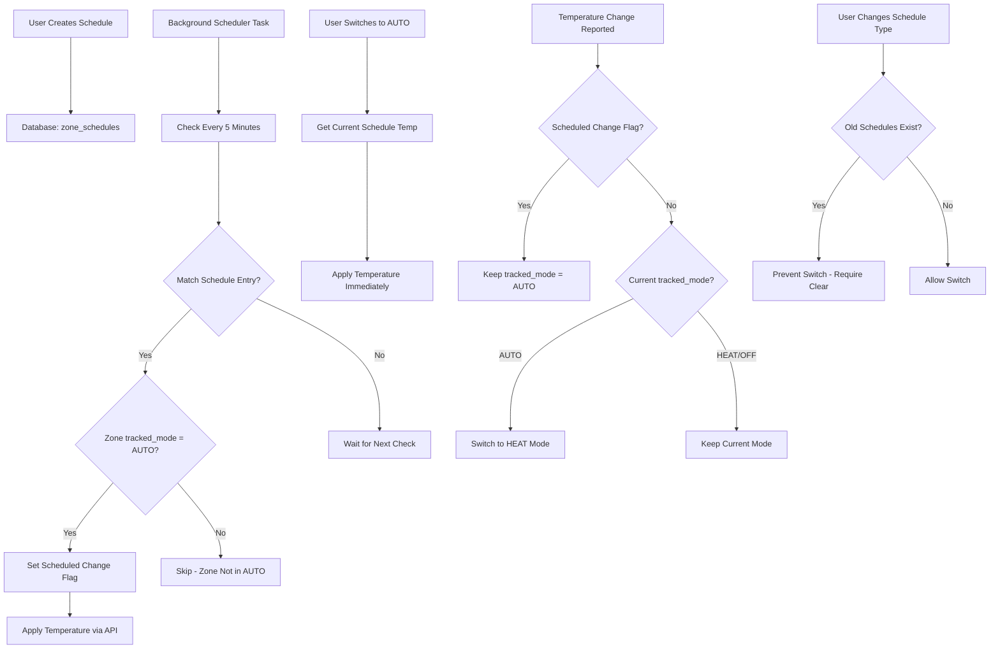

# Temperature Scheduler Implementation

## Overview

This plan implements a temperature scheduler system where each zone can have its own schedules with 3 types (day of week, weekday/weekend, all day). Schedules use 5-minute intervals and are applied by a background task that runs every 5 minutes. The scheduler only applies when zones are in AUTO mode (tracked_mode=3), and properly distinguishes scheduled changes from user/API changes.

## Architecture



## Database Schema

### Migration to Version 4

**New table: `zone_schedules`**

- `schedule_id` (INTEGER PRIMARY KEY AUTOINCREMENT)
- `zone_id` (INTEGER, FOREIGN KEY to zones)
- `schedule_type` (INTEGER: 1=day_of_week, 2=weekday_weekend, 3=all_day)
- `day_of_week` (INTEGER: 0-6 for type 1, NULL for types 2-3)
- `day_type` (TEXT: 'weekday'/'weekend' for type 2, NULL for types 1,3)
- `time` (TEXT: HH:MM format, must be in 5-minute intervals)
- `temperature` (REAL: target temperature in °C)
- `enabled` (BOOLEAN DEFAULT 1)
- `created_at` (TIMESTAMP DEFAULT CURRENT_TIMESTAMP)
- `updated_at` (TIMESTAMP DEFAULT CURRENT_TIMESTAMP)
- FOREIGN KEY (zone_id) REFERENCES zones(zone_id) ON DELETE CASCADE
- UNIQUE(zone_id, schedule_type, day_of_week, day_type, time) - prevent duplicates

**New table: `app_config`**

- `config_key` (TEXT PRIMARY KEY)
- `config_value` (TEXT)
- `updated_at` (TIMESTAMP DEFAULT CURRENT_TIMESTAMP)

Used to store timezone and other app-level configuration.

### Schedule Type Details

1. **Type 1 (day_of_week)**: `day_of_week` contains 0-6 (Monday=0, Sunday=6), `day_type` is NULL
2. **Type 2 (weekday_weekend)**: `day_type` contains 'weekday' or 'weekend', `day_of_week` is NULL
3. **Type 3 (all_day)**: Both `day_of_week` and `day_type` are NULL

## Implementation Files

### 1. Database Migration (`tado_local/database.py`)

- Add migration to version 4:
  - Create `zone_schedules` table with proper constraints
  - Create `app_config` table for timezone storage
  - Add CHECK constraint: `time` must match pattern `HH:MM` where minutes are 00, 05, 10, 15, 20, 25, 30, 35, 40, 45, 50, 55
  - Update `SUPPORTED_SCHEMA_VERSION` to 4

### 2. Scheduler Service (`tado_local/scheduler.py`) - NEW FILE

Create `SchedulerService` class:

- `__init__(db_path: str, tado_api: TadoLocalAPI)` - Initialize with database and API reference
- `start()` - Start background scheduler task
- `stop()` - Stop scheduler gracefully
- `_scheduler_loop()` - Main loop that runs every 5 minutes
- `_check_and_apply_schedules()` - Check all zones and apply matching schedules
- `get_current_schedule_temperature(zone_id: int, current_time: datetime) -> Optional[float]` - Get temperature for current time
- `get_timezone() -> str` - Get timezone from app_config (default to UTC)
- `get_local_now() -> datetime` - Get current local time based on configured timezone
- Uses `asyncio.create_task()` to run background task
- Tracks task in `TadoLocalAPI.background_tasks` for proper cleanup
- Handles timezone conversion using `zoneinfo` (Python 3.11+ standard library)

### 3. State Manager Updates (`tado_local/state.py`)

Add scheduled change tracking:

- `_scheduled_changes: Dict[int, float]` - Track zone_id -> timestamp of last scheduled change
- `mark_scheduled_change(zone_id: int)` - Mark that a change was scheduled
- `is_scheduled_change(zone_id: int, max_age_seconds: float = 10.0) -> bool` - Check if recent change was scheduled
- `clear_scheduled_change(zone_id: int)` - Clear scheduled change flag

### 4. API Routes (`tado_local/routes.py`)

**Schedule Management Endpoints:**

- `GET /zones/{zone_id}/schedules` - Get all schedules for a zone, grouped by type
- `GET /zones/{zone_id}/schedules/type` - Get current schedule type (1, 2, or 3, or null if none)
- `POST /zones/{zone_id}/schedules` - Create new schedule entry
  - Validate `time` is in 5-minute intervals (00, 05, 10, 15, 20, 25, 30, 35, 40, 45, 50, 55)
  - Validate schedule type matches zone's current type (or set type if first schedule)
  - Return 400 if trying to create schedule with different type than existing schedules
- `PUT /zones/{zone_id}/schedules/{schedule_id}` - Update schedule entry
- `DELETE /zones/{zone_id}/schedules/{schedule_id}` - Delete schedule entry
- `DELETE /zones/{zone_id}/schedules` - Clear all schedules for a zone (allows type switching)
- `GET /zones/{zone_id}/schedules/current` - Get current scheduled temperature for zone

**Configuration Endpoints:**

- `GET /config/timezone` - Get configured timezone
- `PUT /config/timezone` - Set timezone (e.g., `{"timezone": "Europe/Amsterdam"}`)
  - Validate using `zoneinfo.ZoneInfo()`
  - Store in `app_config` table

**Zone Control Updates:**

- Update `POST /zones/{zone_id}/set` endpoint:
  - When `mode="auto"` is set, immediately apply current scheduled temperature if available
  - When temperature is changed manually and `tracked_mode == 3` (AUTO), switch to HEAT mode

### 5. API Integration (`tado_local/api.py`)

**Scheduler Integration:**

- Add `scheduler_service: Optional[SchedulerService]` attribute
- In `initialize()`: Create and start scheduler service
- In `cleanup()`: Stop scheduler service gracefully

**Change Detection Updates:**

- In `handle_change()` method:
  - When `target_temperature` changes, check if it was a scheduled change using `state_manager.is_scheduled_change()`
  - If scheduled change: Keep `tracked_mode = AUTO` (don't switch to HEAT)
  - If not scheduled and `tracked_mode == 3` (AUTO): Switch to HEAT mode
  - Clear scheduled change flag after processing (with timeout to handle async updates)

### 6. GUI Updates (`tado_local/static/index.html`)

**New Scheduler Tab in Zone Modal:**

- Add "Scheduler" tab alongside "Controls" and "History"
- Schedule type selector (radio buttons or dropdown):
  - Day of Week (7 schedules)
  - Weekday/Weekend (2 schedules)
  - All Day (1 schedule)
- Show warning if switching types with existing schedules (must clear first)
- Schedule list view:
  - Time and temperature for each schedule
  - Enable/disable toggle
  - Edit/delete buttons
- Add schedule form:
  - Time picker with 5-minute intervals (dropdown: 00:00, 00:05, 00:10, ..., 23:55)
  - Temperature input with +/- buttons
  - Save/Cancel buttons
- Visual schedule timeline (optional enhancement)
- Show current scheduled temperature indicator

**Zone Card Updates:**

- Show schedule indicator when schedules exist
- Show "AUTO" badge when in AUTO mode with schedules

**Timezone Configuration:**

- Add timezone selector in settings/configuration section
- Show current timezone in scheduler UI

### 7. Startup Integration (`tado_local/__main__.py`)

- After `tado_api.initialize()`, start scheduler service
- On startup, scheduler checks and applies current scheduled temperature for zones in AUTO mode

## Implementation Details

### Schedule Matching Logic

```python
def matches_schedule(schedule, current_time, current_day):
    if not schedule['enabled']:
        return False
    
    # Check time (must match exactly at 5-minute intervals)
    schedule_time = parse_time(schedule['time'])  # Returns (hour, minute)
    current_rounded = round_to_5_minutes(current_time)
    
    if schedule_time != current_rounded:
        return False
    
    # Check day based on schedule type
    if schedule['schedule_type'] == 3:  # all_day
        return True
    elif schedule['schedule_type'] == 2:  # weekday_weekend
        is_weekday = current_day < 5  # Monday=0 to Friday=4
        if schedule['day_type'] == 'weekday':
            return is_weekday
        else:  # weekend
            return not is_weekday
    else:  # day_of_week (type 1)
        return schedule['day_of_week'] == current_day
```

### Scheduled Change Tracking

When scheduler applies a temperature:

1. Call `state_manager.mark_scheduled_change(zone_id)` before setting temperature
2. Set temperature via existing API endpoint
3. When `handle_change()` receives the temperature update:

   - Check `state_manager.is_scheduled_change(zone_id)` 
   - If true: Keep `tracked_mode = AUTO`, clear flag after processing
   - If false: If `tracked_mode == AUTO`, switch to HEAT

### Timezone Handling

- Store timezone in `app_config` table with key `'timezone'`
- Use `zoneinfo.ZoneInfo()` for timezone conversion (Python 3.11+)
- Fallback to UTC if timezone not configured or invalid
- Cache timezone in scheduler service, refresh on config change
- All schedule times stored as local time strings (HH:MM)
- Scheduler converts current UTC time to local time for matching

### Schedule Type Switching

- When user tries to create schedule with different type:
  - Check if zone has existing schedules of different type
  - If yes: Return 400 error with message to clear old schedules first
  - Provide `DELETE /zones/{zone_id}/schedules` endpoint to clear all
- After clearing, user can create schedules of new type

### Background Scheduler Task

- Runs every 5 minutes using `asyncio.sleep(300)`
- On each iteration:

  1. Get current local time (using configured timezone)
  2. Round to nearest 5-minute interval (round down)
  3. Query all enabled schedules matching current time/day
  4. For each matching schedule:

     - Check if zone `tracked_mode == 3` (AUTO)
     - If yes: Mark as scheduled change and apply temperature
     - If no: Skip (zone not in AUTO mode)
- Handles errors gracefully with logging and continues running
- On startup: Check and apply current scheduled temperature for AUTO zones

### Graceful Shutdown

- Scheduler task checks `is_shutting_down` flag
- On shutdown signal: Set flag, wait for current iteration to complete
- Task is tracked in `TadoLocalAPI.background_tasks` for proper cancellation
- Cleanup in `TadoLocalAPI.cleanup()` method

## Testing Considerations

1. Test schedule creation/editing/deletion via API
2. Test scheduler applies temperature at correct 5-minute intervals
3. Test schedule type switching (with and without existing schedules)
4. Test scheduled changes don't switch mode from AUTO to HEAT
5. Test manual changes switch from AUTO to HEAT
6. Test switching to AUTO mode applies current scheduled temperature
7. Test scheduler respects AUTO mode (doesn't apply when in HEAT/OFF)
8. Test timezone handling and DST transitions
9. Test scheduler restart on crash
10. Test graceful shutdown
11. Test startup applies current scheduled temperature for AUTO zones

## Migration Path

1. Create database migration to version 4
2. Create `zone_schedules` and `app_config` tables
3. Initialize scheduler service on next app start
4. Existing zones without schedules continue to work normally
5. GUI shows scheduler tab for all zones (empty state if no schedules)
6. Default timezone is UTC (can be configured via API)

## Time Validation

- **Backend validation**: API endpoints validate `time` parameter matches pattern `HH:MM` where minutes are 00, 05, 10, 15, 20, 25, 30, 35, 40, 45, 50, 55
- **Frontend validation**: Time picker restricts input to 5-minute intervals
- **Database constraint**: CHECK constraint: `time GLOB '[0-2][0-9]:[0-5][05]'` (matches HH:MM where minutes are 00, 05, 10, 15, 20, 25, 30, 35, 40, 45, 50, 55)
- **Scheduler matching**: Current time is rounded down to nearest 5-minute interval before comparing

## Error Handling

- Scheduler errors are logged but don't stop the service
- Invalid timezone falls back to UTC with warning
- Database errors are logged and retried
- API errors when applying temperature are logged but don't stop schedule