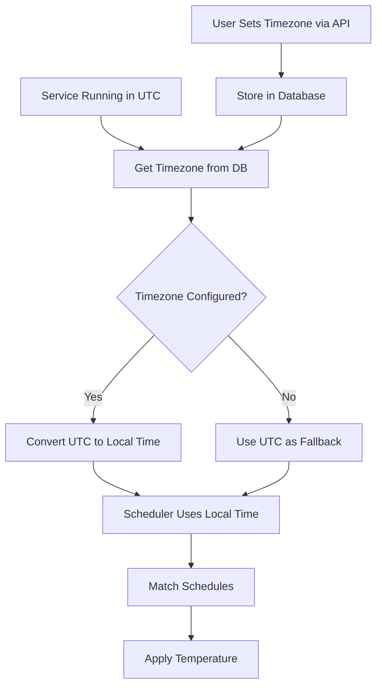

# Timezone Support for Scheduler

## Overview

The scheduler currently uses `datetime.datetime.now()` which uses the system timezone (likely UTC). This plan adds timezone configuration support so users can set their local timezone (e.g., `Europe/Amsterdam`) and the scheduler will automatically use local time for all schedule matching, including proper handling of daylight saving time transitions.

## Architecture

### Data Flow

### Database Schema

The `tado_homes` table already has a `timezone` field that gets synced from Tado Cloud API. We'll use this field, but also allow manual override via a configuration API.

**Option 1 (Recommended)**: Use existing `tado_homes.timezone` field

- Already synced from Tado Cloud
- Can be manually overridden via API
- Single source of truth per home

**Option 2**: Create new `app_config` table for general settings

- More flexible for future configuration
- Separate from Tado Cloud data

We'll go with **Option 1** initially, but make it easy to extend to Option 2 later.

### Implementation Details

#### 1. Timezone Configuration API

Add endpoints in [`tado_local/routes.py`](tado_local/routes.py):

- `GET /config/timezone` - Get current timezone setting
- `PUT /config/timezone` - Set timezone (e.g., `{"timezone": "Europe/Amsterdam"}`)
- Validate timezone using `zoneinfo` (standard library in Python 3.11+)
- Store in `tado_homes.timezone` (update existing row or create if needed)

#### 2. Timezone Helper Functions

Add to [`tado_local/scheduler.py`](tado_local/scheduler.py):

- `get_timezone(db_path: str) -> Optional[str]` - Get timezone from database
- `get_local_now(db_path: str) -> datetime.datetime` - Get current local time
- `utc_to_local(utc_dt: datetime.datetime, timezone_str: str) -> datetime.datetime` - Convert UTC to local
- Fallback to UTC if timezone is not configured or invalid

#### 3. Update Scheduler to Use Local Time

Modify [`tado_local/scheduler.py`](tado_local/scheduler.py):

- Replace all `datetime.datetime.now()` calls with `get_local_now(db_path)`
- Update `_check_and_apply_schedules()` to use local time
- Update `get_current_schedule_temperature()` to use local time
- Ensure timezone-aware datetime objects are used throughout

#### 4. Timezone Validation

- Use `zoneinfo.ZoneInfo(timezone_str)` to validate timezone
- Handle `ZoneInfoNotFoundError` gracefully (fallback to UTC)
- Log warnings when invalid timezone is provided

#### 5. Database Access Pattern

Since scheduler runs in background and needs frequent timezone access:

- Cache timezone in `SchedulerService` instance
- Refresh cache periodically (e.g., every hour) or on configuration change
- Use direct SQLite query for timezone lookup (lightweight operation)

## Files to Modify

1. **[tado_local/scheduler.py](tado_local/scheduler.py)**

   - Add timezone helper functions
   - Update `SchedulerService` to cache and use timezone
   - Replace all `datetime.now()` with timezone-aware local time
   - Update `get_current_schedule_temperature()` to accept timezone

2. **[tado_local/routes.py](tado_local/routes.py)**

   - Add `GET /config/timezone` endpoint
   - Add `PUT /config/timezone` endpoint
   - Validate timezone using `zoneinfo`
   - Update `tado_homes.timezone` in database

3. **[tado_local/database.py](tado_local/database.py)** (if needed)

   - Migration to ensure `tado_homes.timezone` can be manually set
   - No schema changes needed (field already exists)

## Implementation Steps

1. **Add timezone helper functions** to `scheduler.py`

   - `get_timezone()` - Query database for timezone
   - `get_local_now()` - Get current local time
   - `utc_to_local()` - Convert UTC datetime to local

2. **Update SchedulerService class**

   - Add `timezone_cache` and `timezone_cache_time` attributes
   - Add method to get/cache timezone
   - Update `_check_and_apply_schedules()` to use local time
   - Update `get_current_schedule_temperature()` calls to pass timezone

3. **Add configuration API endpoints**

   - `GET /config/timezone` - Returns current timezone
   - `PUT /config/timezone` - Sets timezone with validation
   - Handle case where `tado_homes` table is empty (create default entry)

4. **Update all datetime operations**

   - Replace `datetime.datetime.now()` with `get_local_now()`
   - Ensure all datetime comparisons use timezone-aware objects
   - Test with different timezones and DST transitions

5. **Error handling and logging**

   - Log timezone configuration on scheduler start
   - Log warnings for invalid timezones
   - Fallback to UTC if timezone unavailable

## Testing Considerations

1. Test with different timezones (Europe/Amsterdam, America/New_York, etc.)
2. Test DST transitions (spring forward, fall back)
3. Test with invalid timezone strings (should fallback to UTC)
4. Test with no timezone configured (should use UTC)
5. Test timezone change via API (should update scheduler behavior)
6. Test schedule matching at DST boundaries

## Backward Compatibility

- If no timezone is configured, scheduler continues to use UTC (current behavior)
- Existing schedules continue to work (they're stored as local time strings, not UTC)
- API endpoints are additive (no breaking changes)

## Dependencies

- `zoneinfo` (standard library in Python 3.11+, no additional package needed)
- No changes to `requirements.txt` required